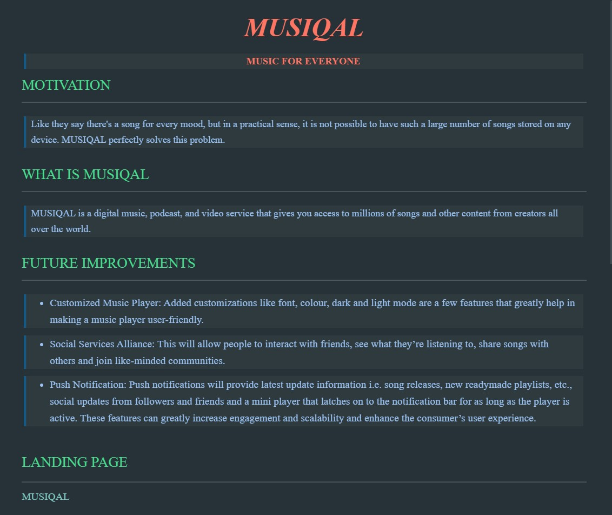

*__MUSIQAL__*

>__MUSIC FOR EVERYONE__

MOTIVATION

---

 

> Like they say there's a song for every mood, but in a practical sense, it is not possible to have such a large number of songs stored on any device. MUSIQAL perfectly solves this problem. 

 

WHAT IS MUSIQAL

---
  

> MUSIQAL is a digital music, podcast, and video service that gives you access to millions of songs and other content from creators all over the world.

  

FUTURE IMPROVEMENTS

---

 

> * Customized Music Player: Added customizations like font, colour, dark and light mode are a few features that greatly help in making a music player user-friendly.

> * Social Services Alliance: This will allow people to interact with friends, see what they’re listening to, share songs with others and join like-minded communities.

> * Push Notification: Push notifications will provide latest update information i.e. song releases, new readymade playlists, etc., social updates from followers and friends and a mini player that latches on to the notification bar for as long as the player is active. These features can greatly increase engagement and scalability and enhance the consumer’s user experience.

  

LANDING PAGE 

---

[MUSIQAL](https://drive.google.com/file/d/1HlAXUA141ILgmg_-zkzHxdIgSpcsL1xl/view)

---
 SCREENSHOT 

